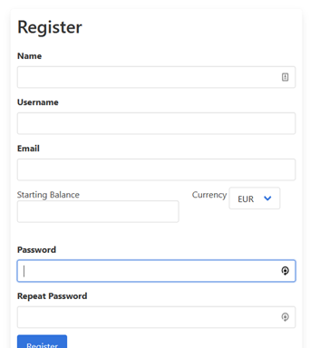
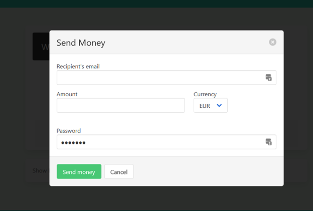

# loko
## Send and receive money in different currencies

Loko is a wallet application where users can create accounts, store and send money to other registered users. The functionality is incomplete it was made in under 2 days from absolutely nothing. It can be accessed at [loko.nyangaga.com](http://loko.nyangaga.com). The source is available at https://github.com/mcflyhalf/loko
Below, I list what it can currently do and what it cannot do but would be expected of a basic application of this kind:

*What has been implemented in Loko do at this point:*
* User registration
* Login/out
* Sending money from an existing user to another (with currency conversion if necessary)
* Keeping track of transaction
* Charging a commission for all user-to-user transactions
* Basic testing

*What hasn’t been implemented yet:*
* Change user’s currency or profile pic
* Daily updating of exchange rates (using a snapshot of a historical rate but this was obtained dynamically and the response pickled to mock the process)
* Display user’s transactions
* Use of task queues (the impact of this will only be visible when there are several users to the site)
* An automated CI/CD pipeline
* Dockerisation

## Walkthrough of Basic Functionality
Unfortunately, the site  has currently been taken down and this functionality currently cannot be used.
### [Tl;dr] Existing Users
On Loko, there are a few existing users that you can use to play around with the functionality (also to know whom you can send money to). Their credentials are given below:
* Usernames – `dev1`, `dev2`, …, `dev6`, `wuser`
* Emails (needed to money) – `dev1@dev.mail`, `dev2@dev.mail`, …,`dev6@dev.mail`, `wuser@cash.com`
* Passwords – `>>Redacted<<` (for all devs i.e. dev1-6) and `>>Redacted<<` for `wuser`
`wuser` is a very wealthy user so she would be ideal for testing out sending money functionality.

### Creating a user
Visit [loko.nyangaga.com/register](loko.nyangaga.com/register) and enter your details as shown below:

Loko is the only application in the world that lets you choose your starting balance and gives you that money for free!!! This is a feature included only in this demo because there is otherwise no way for a user to receive money because you can’t pay money into the application from the real world. Ensure you remember your username, email and password as you need these in the actual application. None of these need to be real values, you can use throw away ones.

### Logging In
After registering, you should be redirected to the [login](loko.nyangaga.com/login) page. Enter your credentials (or any of the existing user credentials) to log in.

### Sending money
On the landing page, click the send money button to send money to a user. You should be greeted with the modal below.

Enter the following:
* Recipient email – Email of the recipient you wish to send money to. This may be another account you created or one of the existing ones listed earlier
* Amount – Amount of money that you wish to send
* Currency – The currency of the above amount. This means that if you wish to send `INR 4900` then regardless of your wallet currency, the amount field needs to be `4900` and currency should be `INR`. Note that when sending money, a user is only allowed to send in their own currency or in the currency of the destination wallet.
* Password – This should be your loko password to authorize the transaction

Your account balance will be updated when you do this. If you are willing to dig into the javascript, you will discover that the account balance of the recipient is also sent back by the server. Finding and displaying this is for demo purposes but is also left as an easter egg for the interested user to try and display.
Note that a charge of 1% of the value of the transaction is charged for every transaction. These amounts are stored in a wallet that belongs to a user who cannot login. This is assumed to be revenue for Loco Inc.

## Installation instructions
Installation is currently not automated. This is because installing the latest version of loko requires previous versions to have already been installed. This is a TODO for the future.
